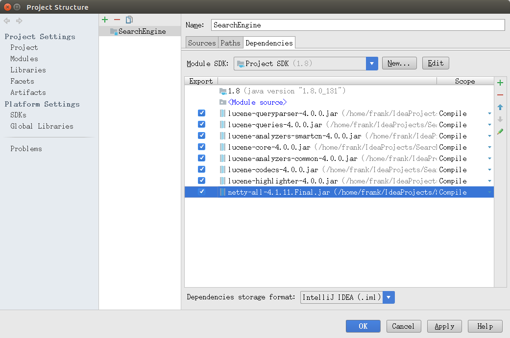

# SearchEngine

### 目录结构

- **./data**：抓取的数据
- **./index**: lucene建立的索引
- **./lucene-4.0.0**: lucene .jar包
- **./src**: java源码
- **netty-all-4.1.11.Final.jar**：netty网络库

### 运行方法

1. 用最新的Idea打开项目
2. 运行SingerDicBuilder。 **./src**目录中会生成**singer.dic**文件，包含了所有歌手名。
3. 运行IndexBuilder。 **./index**目录中会生成**lucene索引**
4. 运行Server。服务器开始运行，可以通过网络连接搜索了。

### 查询方法

首先用 `nc -Cv localhost 8080`命令与服务器建立连接，然后查询：

```
signer: 薛之谦
lrc: 该配合你演出的我
(空行)
```

返回：

```
hits: 2
(空行)
id: 32507038
song: 演员
singer: '*薛之谦*'
lrc: :02.220]*该**配合**你**演出*的*我*演视而不见
[01
(空行)
id: 443277013
song: 火星人来过
singer: '*薛之谦*'
lrc: :02.070]请你*配合**我*  一起难过
(空行)
```

查询：

```
song:love
(空行)
```

返回

```
song:love
hits: 100
(空行)
id: 5246556
song: Is this *love*
singer: '逃跑计划'
(空行)
id: 26211276
song: This Is *Love*
singer: 'will.i.am','Eva Simons'
(空行)
id: 25638055
song: For *Love*
singer: '陈冠希'
(空行)
id: 25706276
song: Is This *Love*
singer: '逃跑计划'
(空行)
id: 306653
song: *Love*
singer: '徐佳莹'
(空行)
id: 460476155
song: *Love*
singer: 'Lana Del Rey'
(空行)
id: 1297705
song: No *Love*
singer: 'Lil Wayne','Eminem'
...
```

点击**徐佳莹的Love**：

```
click: 306653
(空行)
```

返回:

```
hits: 0
(空行)
```

再次查询:

```
song:love
(空行)
```

返回:

```
id: 306653
song: *Love*
singer: '徐佳莹'
(空行)
id: 5246556
song: Is this *love*
singer: '逃跑计划'
(空行)
id: 26211276
song: This Is *Love*
singer: 'will.i.am','Eva Simons'
(空行)
id: 25638055
song: For *Love*
singer: '陈冠希'
...
```

### 注意

- 网络通信中所有的换行符均为“**\r\n**”
- highlight部分用“*****”标记
- 项目依赖的jar包：

